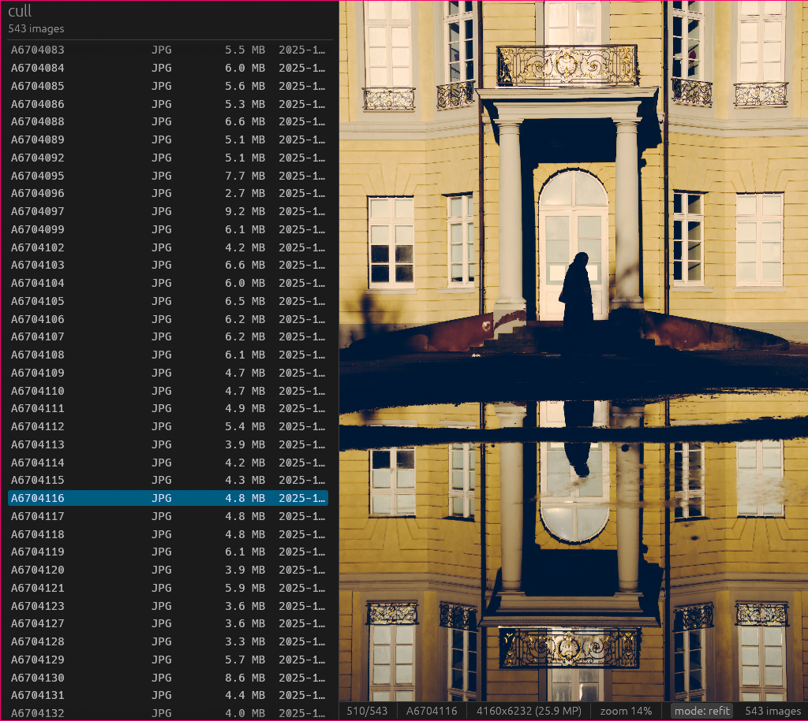

# cull



A fast and simple photo-viewer for *cull*ing photo shoots. 

Features:

* Deletes JPG+RAW pairs together
* Preloads +-10 images into GPU for VERY fast toggling of photos
* Zoom+pan with mouse works as expected
* Simple tree view of directories with image preload on mouse hover
* X to switch between mode:keep-zoom and mode:refit so you can for example toggle between images in order to see zoomed in differences between adjacent images

Probably only works on linux, needs a vulkan-capable graphics card.
I did not find a photo viewer which gruop-deleted JPG+RAW and was fast (I like geeqie, but it's slow), so this is an attempt to solve that.

## Installation

Put the image viewer binary somewhere on your path (e.g. `~/.local/bin/`). Then run `cull .`

## How it works

Files are grouped by basename, so `A6709605.JPG`, `A6709605.ARW` and any RawTherapee
`.pp3` sidecars appear as one row and are deleted together. RAW files are displayed from
the full-size JPEG preview embedded in the file, which decodes faster than the sidecar
JPEG and avoids demosaicing entirely.

A 25 MP frame takes roughly 170 ms to decode, which is far too slow to do on a keypress,
so a window of ±10 images around the cursor is kept decoded at all times. Switching to
one of them is a texture bind. Deletions go to the freedesktop trash and can be undone,
64 deep.

## Keys

| | |
|---|---|
| `→` `↓` `Space` | next image |
| `←` `↑` | previous image |
| `PgDn` `PgUp` | jump ten |
| `Home` `End` | first, last image overall |
| `gg` `G` | first, last image in the current folder |
| `Delete` | mark for deletion |
| `Enter` | confirm it |
| `Esc` | cancel, or quit if nothing is marked |
| `U` | undo the last deletion |
| `X` | toggle refit / keep zoom |
| `F` | fit to window |
| `Z` | zoom 1:1 |
| wheel | zoom at the cursor |
| left-drag | pan |

Deleting takes two keystrokes on purpose. Everything goes to the trash and undo works.

## Building

```
cargo build --release
./target/release/cull ~/Photos/
```

The directory is scanned recursively. Pointing it at a large root is fine; the window
opens immediately and the tree fills in behind it.

## Notes

`RUST_LOG=info` prints startup and scan timings.
